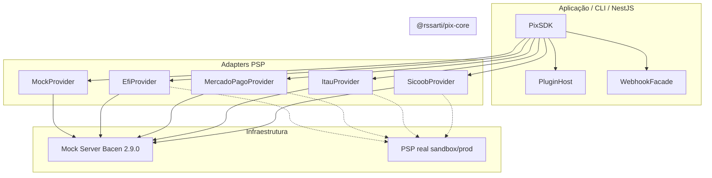

# PIX SDK

[](https://www.npmjs.com/package/@rssarti/pix-sdk)
[](LICENSE)
[](https://github.com/sarti/pix-sdk/actions)
[](https://nodejs.org)

SDK TypeScript pra brincar com PIX no Brasil sem chorar no Slack às 23h. Você escreve uma vez, troca de banco/PSP quando quiser — é plugar outro adapter e vida que segue. Tem mock server local (nada de ficar implorando acesso de sandbox), **PIX Automático**, webhooks com HMAC, plugins pra customizar até o talo e módulo NestJS pros fãs de `@Injectable()`. Arquitetura organizada sim, mas o foco é você colocar cobrança no ar e ir tomar um café ☕

## Índice

- [Instalação](#instalação)
- [Quick Start](#quick-start)
- [Rodando os exemplos](#rodando-os-exemplos)
- [Arquitetura](#arquitetura)
- [Estrutura do monorepo](#estrutura-do-monorepo)
- [Uso do SDK](#uso-do-sdk)
- [Criação de cobrança (request/response)](#criação-de-cobrança-requestresponse)
- [Providers](#providers)
- [PIX Automático](#pix-automático)
- [Webhooks](#webhooks)
- [Plugins](#plugins)
- [CLI](#cli)
- [Mock Server e Docker](#mock-server-e-docker)
- [Integração NestJS](#integração-nestjs)
- [Variáveis de ambiente](#variáveis-de-ambiente)
- [Testes](#testes)
- [Contribuindo](#contribuindo)
- [Licença](#licença)

---

## Instalação

### Aplicação (consumidor)

```bash
npm install @rssarti/pix-sdk
# ou
pnpm add @rssarti/pix-sdk
```

Para usar um PSP específico, instale o pacote do provider:

```bash
pnpm add @rssarti/pix-provider-efi
# @rssarti/pix-provider-mercadopago
# @rssarti/pix-provider-itau
# @rssarti/pix-provider-sicoob
# @rssarti/pix-provider-woovi
```

Integração NestJS:

```bash
pnpm add @rssarti/pix-nestjs @nestjs/common
```

CLI global (opcional):

```bash
pnpm add -g @rssarti/pix-cli
```

### Desenvolvimento (monorepo)

Requisitos: **Node.js ≥ 20**, **pnpm 9**.

```bash
git clone https://github.com/sarti/pix-sdk.git
cd pix-sdk
pnpm install
pnpm build
pnpm test
```

---

## Quick Start

**1. Suba o mock server**

```bash
pnpm --filter @rssarti/pix-mock-server dev
# ou: pix mock start
# ou: docker run -p 3333:3333 sarti/pix-sdk-mock
```

**2. Crie uma cobrança**

```typescript
import { PixSDK, MockProvider, LoggingPlugin } from '@rssarti/pix-sdk';

const pix = new PixSDK({
  provider: new MockProvider({ baseUrl: 'http://localhost:3333' }),
  plugins: [new LoggingPlugin()],
});

const charge = await pix.createCharge({
  amount: 100,
  description: 'Pedido #123',
});

console.log(charge.txid, charge.pixCopyPaste);
```

**3. Demo completa (cobrança + PIX Automático + webhook)**

```bash
pnpm --filter @rssarti/pix-mock-server dev   # terminal 1
pnpm --filter example-node dev             # terminal 2
```

---

## Rodando os exemplos

Apps em `apps/` leem variáveis de `process.env`. Você pode passar tudo inline no console — sem `.env`.

**Terminal 1 — mock server (obrigatório em modo `mock`)**

```bash
pnpm --filter @rssarti/pix-mock-server dev
```

### `example-node` (Efi + Bacen mock)

**Terminal 2**

```bash
# bash / macOS / Linux / Git Bash
PIX_MOCK_URL=http://localhost:3333 pnpm --filter example-node dev

# PowerShell
$env:PIX_MOCK_URL="http://localhost:3333"; pnpm --filter example-node dev
```

`PIX_MOCK_URL` é opcional — default `http://localhost:3333`.

### `example-woovi` (Woovi mock ou sandbox)

**Modo mock** (mock-server no terminal 1):

```bash
# bash
WOOVI_MODE=mock pnpm --filter example-woovi dev

# PowerShell
$env:WOOVI_MODE="mock"; pnpm --filter example-woovi dev

# ou scripts do pacote (cross-env, qualquer SO)
pnpm --filter example-woovi dev:mock
```

**Modo sandbox** (API Woovi real — `WOOVI_APP_ID` obrigatório):

```bash
# bash
WOOVI_MODE=sandbox WOOVI_APP_ID=seu-app-id pnpm --filter example-woovi dev

# PowerShell
$env:WOOVI_MODE="sandbox"; $env:WOOVI_APP_ID="seu-app-id"; pnpm --filter example-woovi dev

# ou
WOOVI_APP_ID=seu-app-id pnpm --filter example-woovi dev:sandbox
```

| Variável | Default | Uso no exemplo |
|----------|---------|----------------|
| `WOOVI_MODE` | `mock` | `mock` \| `sandbox` \| `production` |
| `WOOVI_APP_ID` | — | Obrigatório fora de `mock` |
| `WOOVI_MOCK_URL` | `PIX_MOCK_URL` → `http://localhost:3333` | URL do mock-server |
| `PIX_MOCK_URL` | `http://localhost:3333` | Fallback compartilhado |

---

## Arquitetura

O SDK separa domínio, ports e adapters. A aplicação fala apenas com `PixSDK`; a troca de PSP é feita injetando outro `PixProvider`.



**Fluxo de uma operação**

1. `PixSDK.createCharge()` cria contexto de plugin e delega ao provider.
2. O provider mapeia input canônico → payload Bacen/PSP.
3. Resposta é validada (Zod), mapeada para tipos canônicos e retornada.
4. Plugins executam hooks `onBefore` / `onAfter` / `onError`.

---

## Estrutura do monorepo

```
pix-sdk/
├── packages/
│   ├── core/                 # Domínio, ports, PixSDK, plugins, webhooks
│   ├── shared/               # HTTP client, mTLS, schemas Zod Bacen, HMAC
│   ├── sdk/                  # Entrypoint público (@rssarti/pix-sdk)
│   ├── cli/                  # CLI `pix` / `pix-sdk`
│   ├── mock-server/          # PSP mock (subset API Bacen 2.9.0)
│   ├── nestjs/               # PixModule, PixService, guards
│   ├── provider-mock/          # Adapter → mock-server
│   ├── provider-efi/
│   ├── provider-mercadopago/
│   ├── provider-itau/
│   ├── provider-sicoob/
│   └── provider-woovi/
├── apps/
│   ├── example-node/         # Demo end-to-end (Bacen mock)
│   └── example-woovi/        # Demo Woovi (mock ou sandbox)
└── tooling/                  # ESLint, Jest, TSConfig compartilhados
```

| Pacote | NPM | Descrição |
|--------|-----|-----------|
| `@rssarti/pix-sdk` | ✓ | Facade pública — importe daqui em apps |
| `@rssarti/pix-core` | ✓ | Core desacoplado (domínio + ports) |
| `@rssarti/pix-shared` | ✓ | HTTP, schemas Bacen, resolução de URLs |
| `@rssarti/pix-mock-server` | ✓ | Servidor mock para dev/testes |
| `@rssarti/pix-cli` | ✓ | Ferramenta de linha de comando |
| `@rssarti/pix-nestjs` | ✓ | Módulo NestJS |
| `@rssarti/pix-provider-*` | ✓ | Adapters por PSP |

---

## Uso do SDK

### Inicialização

```typescript
import {
  PixSDK,
  MockProvider,
  RetryPlugin,
  LoggingPlugin,
  MetricsPlugin,
  HmacWebhookVerifier,
} from '@rssarti/pix-sdk';

const pix = new PixSDK({
  provider: new MockProvider({ baseUrl: process.env.PIX_MOCK_URL }),
  plugins: [
    new LoggingPlugin(),
    new RetryPlugin({ maxAttempts: 3, baseDelayMs: 200 }),
    new MetricsPlugin(),
  ],
  webhookSecret: process.env.PIX_WEBHOOK_SECRET,
  signatureVerifier: new HmacWebhookVerifier(),
});

// Registrar plugin depois
pix.use(new RetryPlugin({ maxAttempts: 5 }));
```

### Criar cobrança

```typescript
const charge = await pix.createCharge({
  amount: 100,
  description: 'Pedido #123',
  pixKey: '00000000000',       // opcional
  expirationSeconds: 3600,     // opcional, default 3600
});
```

### Consultar cobrança

```typescript
const charge = await pix.getCharge('mh339kveqb8etbsxdw63xg46k7nfxdg0');
console.log(charge.status); // ACTIVE | COMPLETED | REMOVED | EXPIRED
```

### Estornar (devolução)

```typescript
const refund = await pix.refund({
  transactionId: 'E12345678202406191234567890123456', // endToEndId
  amount: 50,
  refundId: 'devolucao-opcional',                      // opcional
});
// refund.status: PROCESSING | COMPLETED | FAILED
```

---

## Criação de cobrança (request/response)

### Request (SDK → provider)

Input canônico passado a `pix.createCharge()`:

```typescript
{
  amount: 100,
  description: 'Pedido #123',
  pixKey?: string,
  expirationSeconds?: number,
}
```

Payload enviado ao mock-server / Bacen (`POST /cob`):

```json
{
  "calendario": { "expiracao": 3600 },
  "valor": { "original": "100.00" },
  "chave": "00000000000",
  "solicitacaoPagador": "Pedido #123"
}
```

### Response (SDK)

Objeto `Charge` retornado pelo SDK:

```json
{
  "id": "mh339kveqb8etbsxdw63xg46k7nfxdg0",
  "txid": "mh339kveqb8etbsxdw63xg46k7nfxdg0",
  "status": "ACTIVE",
  "amount": { "amount": 100, "currency": "BRL" },
  "description": "Pedido #123",
  "pixCopyPaste": "00020126580014br.gov.bcb.pix0136mh339kveqb8etbsxdw63xg46k7nfxdg05204000053039865802BR5913Mock PIX6009SAO PAULO62070503***6304ABCD",
  "qrCode": "00020126580014br.gov.bcb.pix0136mh339kveqb8etbsxdw63xg46k7nfxdg05204000053039865802BR5913Mock PIX6009SAO PAULO62070503***6304ABCD",
  "createdAt": "2026-06-19T21:02:20.233Z",
  "expiresAt": "2026-06-19T22:02:20.240Z"
}
```

---

## Providers

Todos implementam a interface `PixProvider`. Troca de provider = uma linha no construtor do `PixSDK`.

### Status dos adapters (sem enrolação)

| Provider | Mock local | Sandbox | Produção | Situação |
|----------|:----------:|:-------:|:--------:|----------|
| **Mock** | ✅ | — | — | Sempre local — Bacen simulado |
| **Woovi** | ✅ | ✅ | ✅ | **Adapter real** — cobrança, consulta, refund, webhook e assinatura |
| **Efi** | ✅ | 🚧 | 🚧 | Pacote pronto, API real ainda não |
| **Mercado Pago** | ✅ | 🚧 | 🚧 | Pacote pronto, API real ainda não |
| **Itaú** | ✅ | 🚧 | 🚧 | Pacote pronto, API real ainda não |
| **Sicoob** | ✅ | 🚧 | 🚧 | Pacote pronto, API real ainda não |

**Legenda:** ✅ integração real · 🚧 só mock por enquanto (o adapter existe, mas ainda delega pro mock-server — trocar `mode` pra sandbox/prod **não** chama o PSP de verdade)

> Quer testar sandbox/prod hoje? Use **Woovi**. Os outros estão na fila.

### Pacotes e credenciais

| Provider | Pacote | Env prefix | Credenciais |
|----------|--------|------------|-------------|
| Mock | `@rssarti/pix-sdk` (re-export) | — | `baseUrl` |
| Woovi | `@rssarti/pix-provider-woovi` | `WOOVI` | `appId` |
| Efi | `@rssarti/pix-provider-efi` | `EFI` | `clientId`, `clientSecret`, `certPath` |
| Mercado Pago | `@rssarti/pix-provider-mercadopago` | `MP` | `accessToken` |
| Itaú | `@rssarti/pix-provider-itau` | `ITAU` | `clientId`, `clientSecret`, `certPath`, `keyPath` |
| Sicoob | `@rssarti/pix-provider-sicoob` | `SICOOB` | `clientId`, `clientSecret`, `certPath`, `keyPath` |

### Mock (desenvolvimento)

```typescript
import { PixSDK, MockProvider } from '@rssarti/pix-sdk';

const pix = new PixSDK({
  provider: new MockProvider({ baseUrl: 'http://localhost:3333' }),
});
```

### Woovi (sandbox/prod real)

```typescript
import { PixSDK } from '@rssarti/pix-sdk';
import { WooviProvider } from '@rssarti/pix-provider-woovi';

const pix = new PixSDK({
  provider: new WooviProvider({
    mode: 'sandbox',                    // mock | sandbox | production
    appId: process.env.WOOVI_APP_ID,
  }),
});

const charge = await pix.createCharge({ amount: 10, description: 'Pedido #123' });
console.log(charge.id, charge.pixCopyPaste); // correlationID + brCode
```

Demo: veja [Rodando os exemplos](#rodando-os-exemplos).

### Efi

```typescript
import { PixSDK } from '@rssarti/pix-sdk';
import { EfiProvider } from '@rssarti/pix-provider-efi';

const pix = new PixSDK({
  provider: new EfiProvider({
    mode: 'mock',                              // mock | sandbox | production
    mockBaseUrl: 'http://localhost:3333',
    clientId: process.env.EFI_CLIENT_ID,
    clientSecret: process.env.EFI_CLIENT_SECRET,
    certPath: process.env.EFI_CERT_PATH,
  }),
});
```

### Mercado Pago

```typescript
import { MercadoPagoProvider } from '@rssarti/pix-provider-mercadopago';

const pix = new PixSDK({
  provider: new MercadoPagoProvider({
    mode: 'sandbox',
    accessToken: process.env.MP_ACCESS_TOKEN,
  }),
});
```

### Itaú / Sicoob

```typescript
import { ItauProvider } from '@rssarti/pix-provider-itau';
import { SicoobProvider } from '@rssarti/pix-provider-sicoob';

new PixSDK({ provider: new ItauProvider({ mode: 'production' }) });
new PixSDK({ provider: new SicoobProvider({ mode: 'sandbox' }) });
```

### Modos de operação

Cada provider aceita `mode`:

| Modo | Comportamento |
|------|---------------|
| `mock` | Aponta para mock-server local (default) |
| `sandbox` | URL de homologação do PSP |
| `production` | URL de produção do PSP |

Resolução de URL: config explícita → env `{PREFIX}_*_URL` → fallback `PIX_MOCK_URL`.

> **Woovi** usa sandbox/prod de verdade. Nos demais adapters, sandbox/prod ainda não estão implementados — veja a tabela de status acima.

---

## PIX Automático

API exposta em `pix.automatic` (recorrência Bacen: `/rec`, `/cobr`).

```typescript
// Criar autorização
const auth = await pix.automatic.createAuthorization({
  contractId: 'contract-001',
  debtorDocument: '12345678901',
  debtorName: 'João Silva',          // opcional
  amount: 49.9,
  periodicity: 'MONTHLY',            // WEEKLY | MONTHLY | QUARTERLY | SEMIANNUAL | ANNUAL
});

// Consultar autorização
const status = await pix.automatic.getAuthorization(auth.id);

// Agendar cobrança recorrente
const schedule = await pix.automatic.schedule({
  authorizationId: auth.id,
  amount: 49.9,
  scheduledAt: new Date(),           // opcional
});

// Cancelar autorização
await pix.automatic.cancel({
  authorizationId: auth.id,
  reason: 'Cliente solicitou',       // opcional
});
```

**Status de autorização:** `CREATED` → `APPROVED` | `REJECTED` → `CANCELLED`

**Eventos de webhook automático:** `PIX_AUTOMATIC_AUTHORIZED`, `PIX_AUTOMATIC_REJECTED`, `PIX_AUTOMATIC_SCHEDULED`, `PIX_AUTOMATIC_CANCELLED`

---

## Webhooks

### Parse e normalização

```typescript
import { pixEventEmitter, HmacWebhookVerifier } from '@rssarti/pix-sdk';

const pix = new PixSDK({
  provider: new MockProvider(),
  webhookSecret: process.env.PIX_WEBHOOK_SECRET,
  signatureVerifier: new HmacWebhookVerifier(),
});

// Em handler HTTP (Express/Fastify/NestJS)
const event = await pix.webhooks.parse(
  req.body,
  req.headers,
  rawBody, // string | Buffer — obrigatório se webhookSecret configurado
);

console.log(event.type);           // PIX_PAID, PIX_REFUNDED, etc.
console.log(event.transactionId);  // txid ou endToEndId
console.log(event.eventId);        // idempotência
```

### Eventos suportados

| Tipo | Descrição |
|------|-----------|
| `PIX_PAID` | Pagamento confirmado |
| `PIX_REFUNDED` | Devolução processada |
| `PIX_EXPIRED` | Cobrança expirada |
| `PIX_AUTOMATIC_*` | Ciclo de vida PIX Automático |

### Listener global

```typescript
import { pixEventEmitter } from '@rssarti/pix-sdk';

pixEventEmitter.onEvent('PIX_PAID', (event) => {
  console.log('Pago:', event.transactionId, event.amount);
});
```

O `WebhookService` deduplica eventos pelo `eventId` — reentregas não disparam o emitter novamente.

### Verificação de assinatura

Header esperado: `x-pix-signature` (HMAC-SHA256 via `@rssarti/pix-shared`).

### Simular webhook no mock-server

```bash
curl -X POST http://localhost:3333/webhook/simulate \
  -H "Content-Type: application/json" \
  -d '{"type":"PIX_RECEBIDO","txid":"mh339kveqb8etbsxdw63xg46k7nfxdg0","amount":"100.00"}'
```

---

## Plugins

Implementam `PixPlugin` com hooks assíncronos.

| Plugin | Pacote | Função |
|--------|--------|--------|
| `LoggingPlugin` | `@rssarti/pix-sdk` | Log estruturado (pino) por operação |
| `RetryPlugin` | `@rssarti/pix-sdk` | Retry exponencial em erros `retryable` |
| `MetricsPlugin` | `@rssarti/pix-sdk` | Contadores e histogramas via `MetricsSink` |

```typescript
import { MetricsPlugin, NoopMetricsSink } from '@rssarti/pix-sdk';

class DatadogSink extends NoopMetricsSink {
  increment(name: string, tags?: Record<string, string>) {
    // enviar para Datadog/StatsD
  }
  histogram(name: string, value: number, tags?: Record<string, string>) {
    // enviar latência
  }
}

pix.use(new MetricsPlugin(new DatadogSink()));
```

### Plugin customizado

```typescript
import type { PixPlugin } from '@rssarti/pix-sdk';

class AuditPlugin implements PixPlugin {
  readonly name = 'audit';

  async onAfter(ctx) {
    await auditLog.write({
      operation: ctx.operation,
      provider: ctx.provider,
      durationMs: Date.now() - ctx.startTime,
    });
  }
}

pix.use(new AuditPlugin());
```

---

## CLI

Binários: `pix` e `pix-sdk` (`@rssarti/pix-cli`).

```bash
# Criar cobrança
pix charge create --amount 100 --description "Pedido #123"
pix charge create --amount 50 --mock-url http://localhost:3333

# Consultar cobrança
pix charge get --id mh339kveqb8etbsxdw63xg46k7nfxdg0

# Subir mock server
pix mock start
pix mock start --port 3333

# Escutar webhooks (com forward opcional)
pix webhook listen --port 4444
pix webhook listen --port 4444 --forward http://localhost:3000/webhooks/pix
```

No monorepo, após `pnpm build`:

```bash
pnpm exec pix charge create --amount 100 --description "Teste"
```

---

## Mock Server e Docker

Servidor HTTP in-memory que implementa subset da **API PIX Bacen 2.9.0** para desenvolvimento e testes de integração.

### Endpoints

| Método | Rota | Descrição |
|--------|------|-----------|
| `POST` | `/cob` | Criar cobrança imediata |
| `GET` | `/cob/:txid` | Consultar cobrança |
| `PATCH` | `/cob/:txid` | Atualizar status |
| `GET` | `/pix` | Listar PIX recebidos |
| `PUT` | `/pix/:e2eid/devolucao/:id` | Devolução |
| `POST` | `/rec` | Criar recorrência (PIX Automático) |
| `GET/PATCH` | `/rec/:idRec` | Consultar/atualizar recorrência |
| `POST` | `/rec/solicrec` | Aprovar recorrência |
| `POST` | `/cobr` | Agendar cobrança recorrente |
| `POST` | `/webhook/simulate` | Simular evento de pagamento |
| `GET` | `/health` | Health check |

### Executar localmente

```bash
# Via pnpm (monorepo)
pnpm --filter @rssarti/pix-mock-server dev

# Via CLI
pix mock start --port 3333

# Via binário do pacote
npx @rssarti/pix-mock-server
```

### Docker

```bash
docker build -f packages/mock-server/Dockerfile -t sarti/pix-sdk-mock .
docker run -p 3333:3333 -e PORT=3333 sarti/pix-sdk-mock
```

Health check:

```bash
curl http://localhost:3333/health
# {"status":"ok"}
```

---

## Integração NestJS

Pacote: `@rssarti/pix-nestjs`

### Módulo síncrono

```typescript
import { Module } from '@nestjs/common';
import { PixModule, PixService } from '@rssarti/pix-nestjs';
import { MockProvider, LoggingPlugin } from '@rssarti/pix-sdk';

@Module({
  imports: [
    PixModule.forRoot({
      provider: new MockProvider({ baseUrl: 'http://localhost:3333' }),
      plugins: [new LoggingPlugin()],
      webhookSecret: process.env.PIX_WEBHOOK_SECRET,
    }),
  ],
})
export class AppModule {}
```

### Módulo assíncrono (ConfigService)

```typescript
PixModule.forRootAsync({
  inject: [ConfigService],
  useFactory: (config: ConfigService) => ({
    provider: new EfiProvider({
      mode: config.get('PIX_PROVIDER_MODE', 'mock'),
      clientId: config.get('EFI_CLIENT_ID'),
      clientSecret: config.get('EFI_CLIENT_SECRET'),
    }),
    webhookSecret: config.get('PIX_WEBHOOK_SECRET'),
  }),
})
```

### Service

```typescript
import { Injectable } from '@nestjs/common';
import { PixService } from '@rssarti/pix-nestjs';

@Injectable()
export class OrderService {
  constructor(private readonly pix: PixService) {}

  async createPixCharge(orderId: string, amount: number) {
    return this.pix.createCharge({
      amount,
      description: `Pedido ${orderId}`,
    });
  }

  // Acesso direto ao SDK
  async handleWebhook(body: unknown, headers: Record<string, string>, raw: string) {
    return this.pix.sdk.webhooks.parse(body, headers, raw);
  }
}
```

### Webhook controller com guard

```typescript
import { Controller, Post, Body, Headers, UseGuards, RawBodyRequest, Req } from '@nestjs/common';
import { PixService, PixWebhookGuard } from '@rssarti/pix-nestjs';

@Controller('webhooks/pix')
export class PixWebhookController {
  constructor(private readonly pix: PixService) {}

  @Post()
  @UseGuards(PixWebhookGuard)
  async handle(@Req() req: RawBodyRequest<Request>, @Body() body: unknown, @Headers() headers: Record<string, string>) {
    const event = await this.pix.sdk.webhooks.parse(body, headers, JSON.stringify(body));
    return { received: true, type: event.type };
  }
}
```

`PixWebhookGuard` valida assinatura quando `PIX_WEBHOOK_SECRET` está definido.

Exports disponíveis: `PixModule`, `PixService`, `PixWebhookGuard`, `PixWebhook`, `PIX_SDK`, `PIX_PROVIDER`.

---

## Variáveis de ambiente

### Globais

| Variável | Default | Descrição |
|----------|---------|-----------|
| `PIX_PROVIDER_MODE` | `mock` | Modo global: `mock`, `sandbox`, `production` |
| `PIX_MOCK_URL` | `http://localhost:3333` | URL do mock-server |
| `PIX_WEBHOOK_SECRET` | — | Segredo HMAC para validação de webhooks |
| `PORT` | `3333` | Porta do mock-server (Docker/CLI) |

### Woovi

| Variável | Default | Descrição |
|----------|---------|-----------|
| `WOOVI_MODE` | `mock` | `mock`, `sandbox`, `production` |
| `WOOVI_APP_ID` | — | App ID OpenPix/Woovi |
| `WOOVI_MOCK_URL` | `PIX_MOCK_URL` | URL do mock-server |
| `WOOVI_SANDBOX_URL` | — | Override URL sandbox |
| `WOOVI_PRODUCTION_URL` | — | Override URL produção |

### Por provider (`{PREFIX}` = `EFI`, `MP`, `ITAU`, `SICOOB`)

| Variável | Descrição |
|----------|-----------|
| `{PREFIX}_MOCK_URL` | Override da URL mock por provider |
| `{PREFIX}_SANDBOX_URL` | URL sandbox do PSP |
| `{PREFIX}_PRODUCTION_URL` | URL produção do PSP |

### Credenciais PSP (via config ou env na app)

| Provider | Variáveis típicas |
|----------|-------------------|
| Efi | `EFI_CLIENT_ID`, `EFI_CLIENT_SECRET`, `EFI_CERT_PATH` |
| Mercado Pago | `MP_ACCESS_TOKEN` |
| Itaú | `ITAU_CLIENT_ID`, `ITAU_CLIENT_SECRET`, `ITAU_CERT_PATH`, `ITAU_KEY_PATH` |
| Sicoob | `SICOOB_CLIENT_ID`, `SICOOB_CLIENT_SECRET`, `SICOOB_CERT_PATH`, `SICOOB_KEY_PATH` |

Exemplo `.env` para desenvolvimento local:

```env
PIX_PROVIDER_MODE=mock
PIX_MOCK_URL=http://localhost:3333
PIX_WEBHOOK_SECRET=dev-secret-change-me
```

---

## Testes

```bash
# Todos os pacotes
pnpm test

# Pacote específico
pnpm --filter @rssarti/pix-core test
pnpm --filter @rssarti/pix-mock-server test

# Typecheck e lint
pnpm typecheck
pnpm lint
```

Testes de integração do mock provider rodam contra o mock-server in-process. Cobertura inclui: facade `PixSDK`, plugins, webhooks (idempotência + HMAC), PIX Automático e endpoints do mock-server.

---

## Contribuindo

1. Fork o repositório e crie uma branch: `git checkout -b feat/minha-feature`
2. Instale dependências: `pnpm install`
3. Faça alterações com testes: `pnpm test`
4. Garanta build e lint: `pnpm build && pnpm lint`
5. Abra um Pull Request descrevendo a mudança e o plano de teste

**Convenções**

- TypeScript strict, ESM (`"type": "module"`)
- Adapters de provider implementam `PixProvider` em `@rssarti/pix-core`
- Schemas Bacen ficam em `@rssarti/pix-shared`
- Changesets para versionamento (`pnpm changeset`)

**Adicionar um novo provider**

1. Crie `packages/provider-{nome}/` implementando `PixProvider`
2. Mapeie payloads PSP ↔ tipos canônicos (`Charge`, `Refund`, `PixWebhookEvent`)
3. Exponha config com `BaseProviderConfig` + credenciais específicas
4. Adicione testes de integração contra mock-server ou sandbox

---

## Licença

[MIT](LICENSE) — © Sarti
